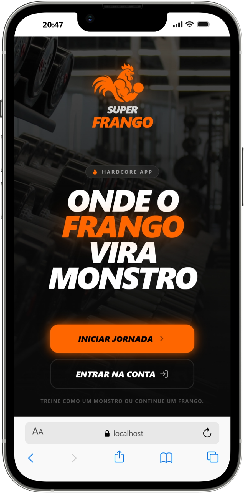
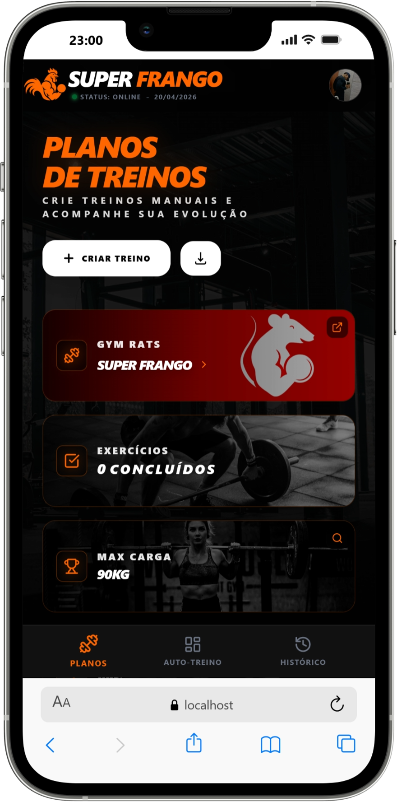
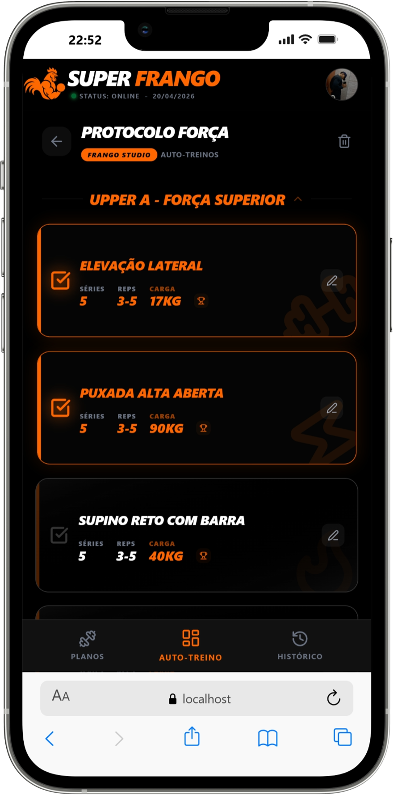
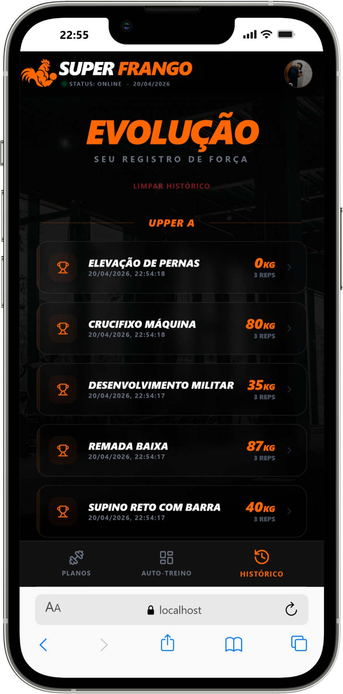

<div align="center">
  
# **Super Frango App**
  *"A força não vem do corpo. Vem da vontade de nunca parar."*

  [](https://gym-app-front.vercel.app)
  [](https://reactjs.org/)
  [](https://tailwindcss.com/)
  [](https://vitejs.dev/)
  [](https://web.dev/progressive-web-apps/)

</div>


## 📱 **Sobre o Projeto**

O **Super Frango App** é um aplicativo mobile-first de gerenciamento de treinos desenvolvido para suprir uma necessidade real minha e de um grupo de amigos. Inspirado no nosso grupo "Super Frango" do **[Gym Rats](https://gymrats.app/)** (aplicativo de desafios em grupo na academia), o projeto nasceu da necessidade de **compartilhar treinos** e **acompanhar evolução** de forma prática e personalizada. As cores, o nome e a identidade visual foram totalmente inspirados no grupo, trazendo uma identidade única e familiar para os membros.

A **API** foi desenvolvida com o objetivo de consolidar habilidades técnicas em **Node.js, Express e MongoDB**. Partindo de uma base já existente, foram adicionadas apenas mais algumas funcionalidades essenciais e integradas ao frontend. Este foi construído integralmente em **React** para atender às necessidades do projeto e aplicar boas práticas do framework. Confira o repositório da API do app: [gym-api](https://github.com/Geovanni-dev/gym-app-api).

> ⚠️ **Aviso:** Este aplicativo foi desenvolvido **visando experiência mobile**. Para aproveitar ao máximo no desktop, recomendo baixar a extensão **"Mobile Simulator"** do Google Chrome (gratuita) e escolher o dispositivo de sua preferência para uma visualização otimizada.


## 🖥️  **Demonstração**

<p align="center">
  
  
  
  
</p>

---

## ⚡ **Funcionalidades**

| Funcionalidade | Descrição |
|----------------|-----------|
| 📋 **Planos Inteligentes** | Crie treinos do zero ou gere automaticamente por objetivo |
| 👥 **Ecossistema Social** | Importe treinos de amigos via código único |
| 🏋️ **Modo Treino Ativo** | Checklist interativo com registro de histórico em tempo real |
| 🏆 **Hall dos PRs** | Acompanhe seus recordes pessoais por exercício |
| 📸 **Upload de Foto** | Integração com Cloudinary para foto de perfil |
| 📱 **PWA Ready** | Instale como app nativo no celular |

---

## 📱 **Diferenciais de UX Mobile**

Para entregar uma experiência próxima a um app nativo, foram implementadas:

- 🪟 **Overlays Inteligentes:** Edições utilizam camadas flutuantes, preservando o scroll e o estado da página principal
- ⌨️ **Keyboard Awareness:** Detecção automática de teclado no Android para liberar espaço de input
- 📜 **Scroll Controlado:** Uso de `overscroll-behavior-y: contain` para evitar pull-to-refresh indesejado

---

## 🛠️ **Tecnologias**

| Categoria | Tecnologia | Finalidade |
|:----------|:-----------|:-----------|
| **Core** | `React 18` | Biblioteca de UI |
| **Tooling** | `Vite` | Build tool ultra-rápido |
| **Styles** | `Tailwind CSS` | Estilização utilitária e responsiva |
| **Forms** | `React Hook Form` | Gerenciamento de formulários |
| **Validation** | `Zod` | Validação de schemas tipados |
| **HTTP** | `Axios` | Consumo da API REST |
| **PWA** | `Vite PWA` | Progressive Web App |

---

## 📂 **Estrutura de Pastas**

```
src/
├── components/   # UI Reutilizável & Modais (Overlays)
├── views/        # Telas principais da aplicação
├── hooks/        # Lógica customizada (ScrollLock, Mobile detection)
├── services/     # Camada de dados e chamadas API
└── utils/        # Temas e funções auxiliares
```

---

## 📱 **Instalação como PWA (Mobile)**

Acesse o app diretamente: [https://gr-s.onrender.com/super-frango](https://gr-s.onrender.com/super-frango)

| Plataforma | Como instalar |
|------------|---------------|
| **Android** | Chrome → Menu (três pontos) → Instalar aplicativo |
| **iOS** | Safari → Compartilhar → Adicionar à Tela de Início |

> ✨ Após a instalação, o app terá ícone personalizado e abrirá em tela cheia, sem a barra de endereços do navegador.

---

## 🌐 **Deploy na Vercel**

O frontend está hospedado na **Vercel** (plataforma cloud gratuita).

### ✅ Por que Vercel?

- Deploy gratuito e simples
- Integração direta com GitHub
- Suporte nativo a React e Vite
- SSL automático (HTTPS)
- Preview automático a cada push

---

## 💻 **Rodando Localmente**

```bash
# Clone o repositório
git clone https://github.com/Geovanni-dev/gym-app-front.git

# Acesse a pasta
cd gym-app-front

# Instale as dependências
npm install

# Execute o projeto
npm run dev
```

---

## 🐛 **Contribuindo com o Projeto**

Se você encontrou algum **bug**, tem **sugestão de melhoria** ou ideia de **nova funcionalidade**, ficarei muito grato se compartilhar!

### Como contribuir:

- Abra uma **Issue** no GitHub [clicando aqui](https://github.com/Geovanni-dev/gym-app-front/issues)
- Descreva detalhadamente o problema ou sugestão
- Se possível, adicione prints ou passos para reproduzir o bug

> 💡 Sua contribuição me ajuda a evoluir como profissional e tornar o projeto cada vez melhor!


## 📄 **Licença**

MIT © [Geovani Rodrigues](https://github.com/Geovanni-dev)

